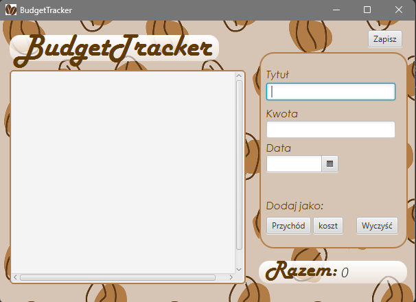

# BudgetTracker 
Aplikacja do śledzenia budżetu. 
Jeśli nie mamy pliku do załadowania z poprzednimi naszymi danymi utworzonymi w aplikacji
po prostu klikamy anuluj i możemy tworzyć naszą liste z wydatkami/przychodami. Interfejs aplikacji prezentuje się następująco:  

